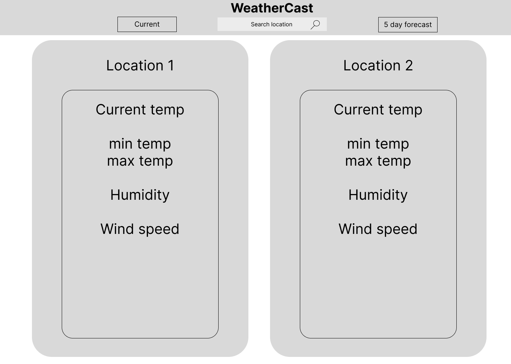
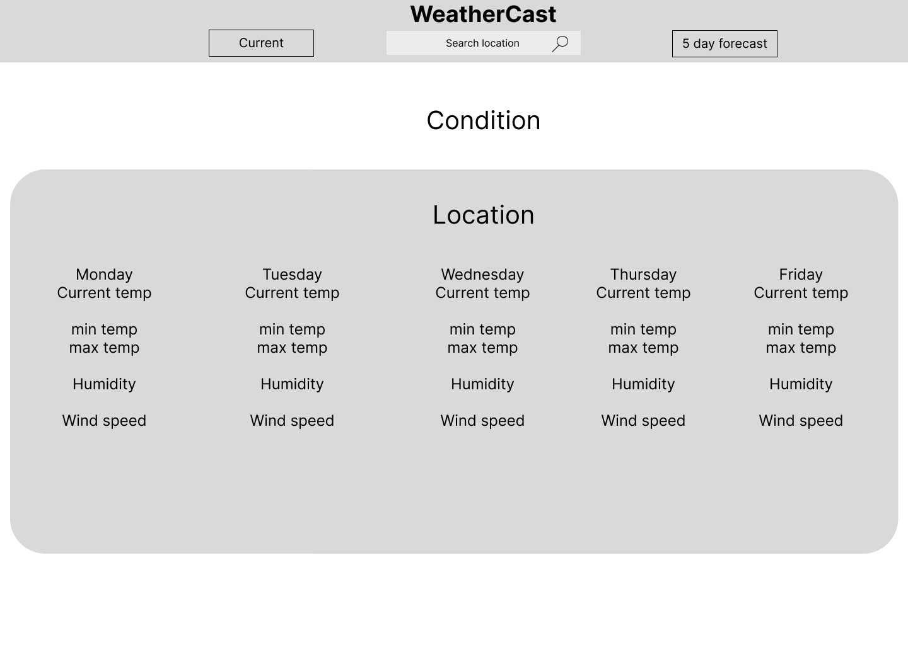

# weather-cast

## WeatherCast

An app that displays current weather of up to 2 locations and also a 5 day forecast of the current location.

## Technology

- React
- Material UI React component library

## Wireframes

Basic structure of the application layout

## General Approach

- Find an API that provides the data needed.
- Planning the structure of the app interfaces.
- Install necessary dependencies.
- Create components needed for the application.
  - To display the current and five-day weather forecast.
  - Navigation bar to include the use of routes.
  - User input component to get the location.
- Decide the placement of the different states.
- Introduce functions to add functionality.
- Utilize asynchronous functions to fetch data.
- Manually test the app after every implementation of new features.
- Add final styling to the different components.

## Problems faced

- Limited API calls & features for the base service.
- App renders before it receives data from the API.
- Incorporating dynamic components to the app.

## Acknowledgments

- Weather data provided by [OpenWeatherMap](https://openweathermap.org/)
- Project uses [Material UI](https://mui.com/), a React UI library for building responsive user interfaces and is licensed under the MIT License. Credits to the Material UI team for providing this library and making it available under an open-source license.
- Image source: https://www.pexels.com/photo/beautiful-clouds-cloudy-dramatic-209831/
- [Figma](https://www.figma.com/): the collaborative interface design tool.
